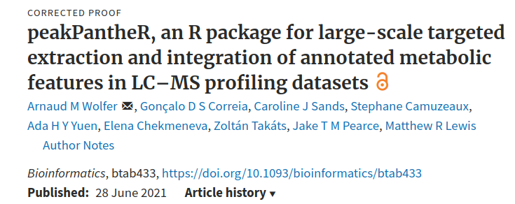
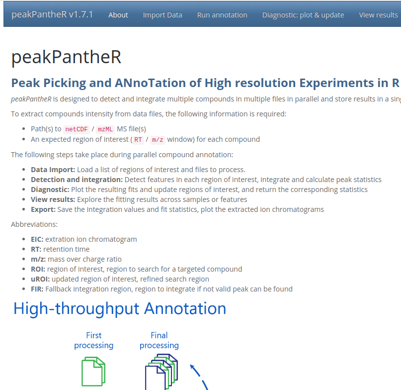
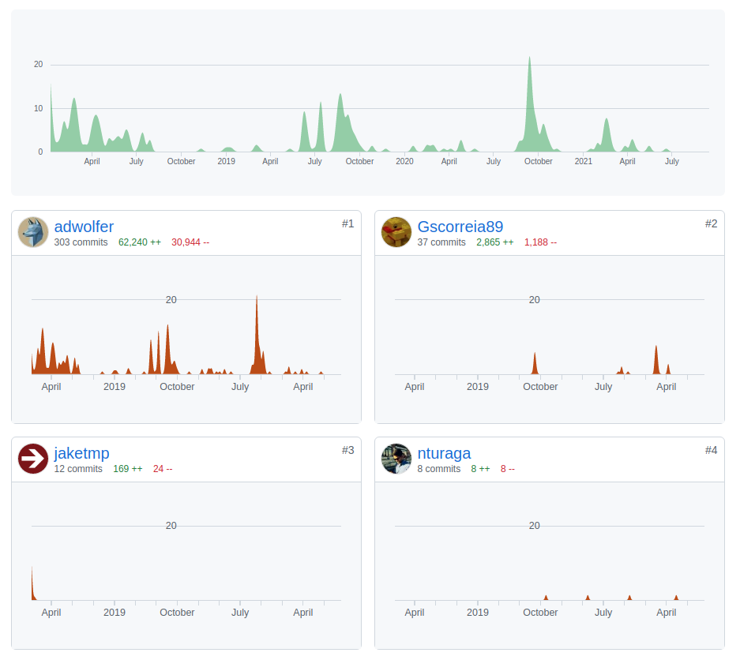

<link href="https://fonts.googleapis.com/css?family=Montserrat&display=swap" rel="stylesheet">

<style>
slides > slide {
  font-family: 'Montserrat', sans-serif;
}

.center {
  display: block;
  margin-left: auto;
  margin-right: auto;

}


</style>

```{r setup, include=FALSE}
knitr::opts_chunk$set(echo = TRUE)
```

# Wstęp

## Krystyna Grzesiak

<div style="float: left; width: 50%; font-size:20px;">

 - Matematyk (ze specjalnością analiza danych),
 - Miłośniczka **R** i proteomiki,
 - uwielbia wspinaczkę.
 
</div>

<div style="float: right; width: 50%;">


</div>

# peakPantheR

## Dlaczego peakPantheR?




## Dlaczego peakPantheR?


<div style="float: left; width: 50%; font-size:20px;">
 - **jest 3x R**,
 - jest paczką Bioconductora, które wymaga nieco więcej wysiłku przy instalacji niż paczki z CRANu,
 - jest bardzo aktywnie wspierany.
</div>

<div style="float: right; width: 50%;">



</div>


## Dlaczego peakPantheR?


<div style="float: left; width: 50%; font-size:20px;">
 - jest 3x R,
 - **jest paczką Bioconductora, które wymaga nieco więcej wysiłku przy instalacji niż paczki z CRANu**,
 - jest bardzo aktywnie wspierany.
</div>

<div style="float: right; width: 40%;">

```{r,eval=FALSE}

install.packages("BiocManager")
BiocManager::install("phenomecentre/peakPantheR")
library(peakPantheR)

```

</div>


## Dlaczego peakPantheR?


<div style="float: left; width: 50%; font-size:20px;">
 - jest 3x R,
 - jest paczką Bioconductora, które wymaga nieco więcej wysiłku przy instalacji niż paczki z CRANu,
 - **jest bardzo aktywnie wspierany**.
</div>

<div style="float: right; width: 50%;">

</div>

## Rozwój peakPantheRa



## Instalacja peakPantheRa

```{r,eval=FALSE}

# instalacja BiocManager, niezbędny aby wykorzystywać paczki z Bioconductora

install.packages("BiocManager")

# instalacja peakPantheR

BiocManager::install("phenomecentre/peakPantheR")

# ładujemy peakPantheR

library(peakPantheR)

# uruchamiamy GUI

peakPantheR_start_GUI(browser = TRUE)

```
