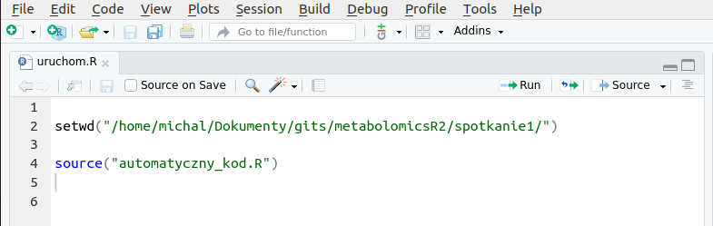
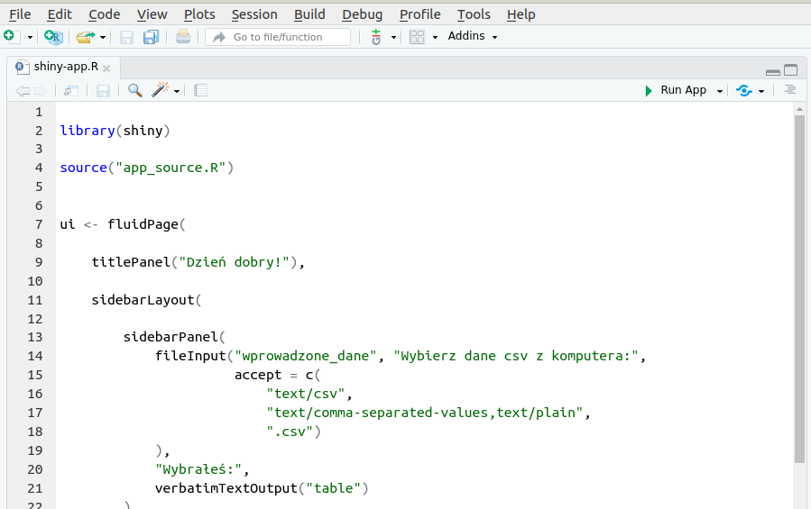
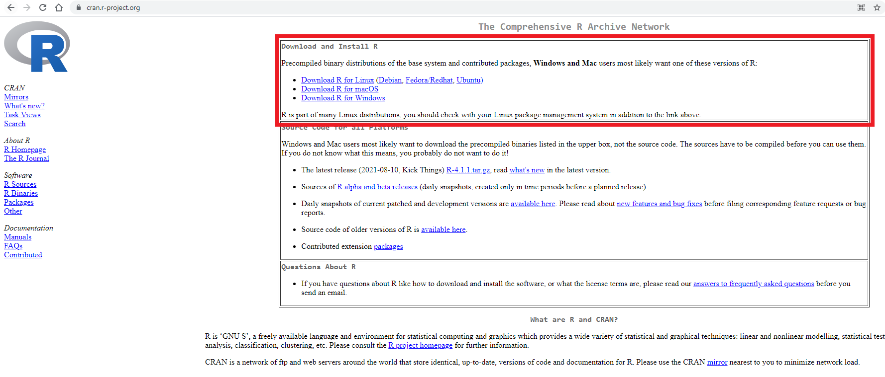
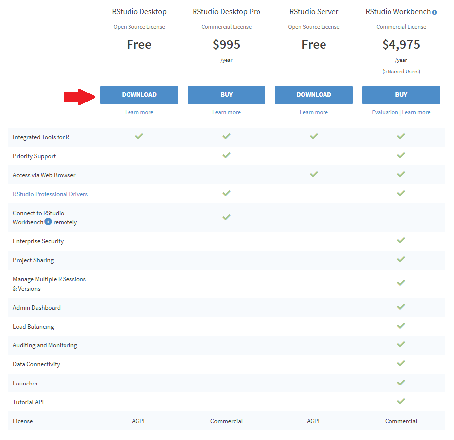
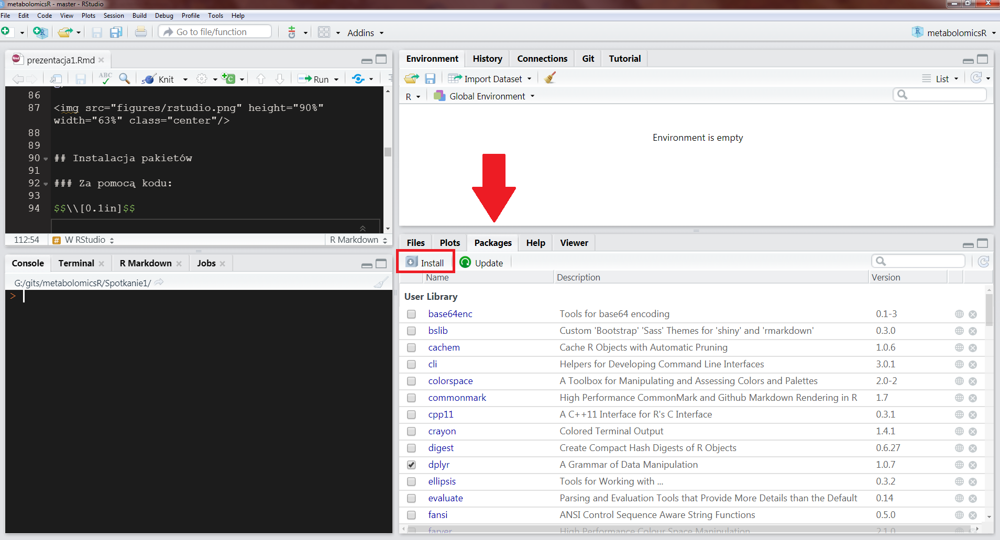
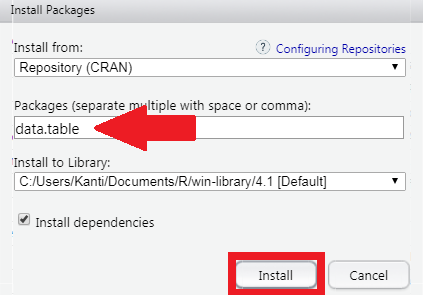
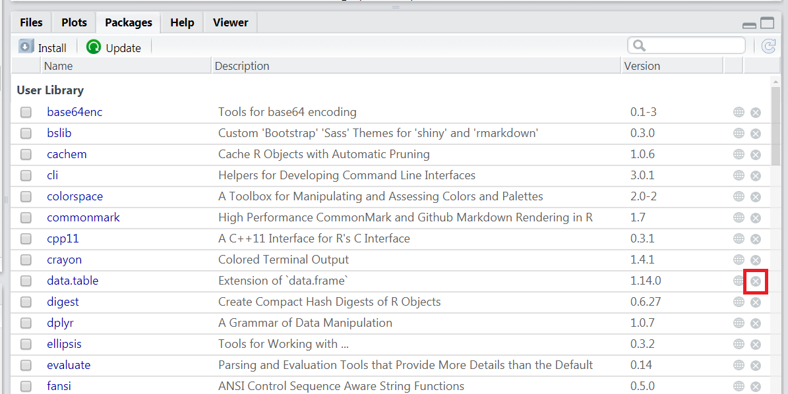
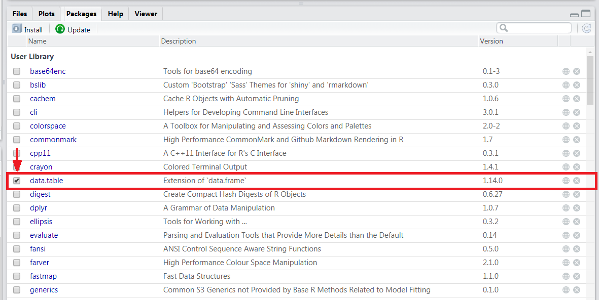

<link href="https://fonts.googleapis.com/css?family=Montserrat&display=swap" rel="stylesheet">

<style>
slides > slide {
font-family: 'Montserrat', sans-serif;
}

.center {
display: block;
margin-left: auto;
margin-right: auto;

}


</style>

```{r setup, include=FALSE}
knitr::opts_chunk$set(echo = TRUE)
```

# Wstęp

## Krystyna Grzesiak

<div style="float: left; width: 50%; font-size:20px;">

- Matematyk (ze specjalnością analiza danych),
- Miłośniczka **R** i proteomiki,
- uwielbia wspinaczkę.

</div>

<div style="float: right; width: 50%;">


</div>

# 3x R

## Dlaczego 3x R?

Pracować w R możemy na trzy różne sposoby.

1. Pisać skrypty od początku.
2. Wykorzystywać gotowe funkcje.
3. Używać GUI w Shiny.

## Pisać skrypty od początku

[Link do kodu](https://github.com/michbur/metabolomicsR/blob/master/spotkanie1/kod.R).

## Wykorzystywać gotowe funkcje



Source

## Używać GUI w Shiny



Run App

# Konfiguracja środowiska R

## Instalacja R

[https://cran.r-project.org/](https://cran.r-project.org/)




## Instalacja RStudio

[https://www.rstudio.com/products/rstudio/download/](https://www.rstudio.com/products/rstudio/download/)




## Instalacja pakietów

### Za pomocą kodu:

$$\\[0.1in]$$

```{r, eval = FALSE}


install.packages("data.table")

remove.packages("data.table")


```


##

### W RStudio




##



##

### Odinstalowywanie pakietów w RStudio



## Ładowanie pakietów

### Za pomocą kodu:

$$\\[0.1in]$$

```{r}
library(data.table)

detach("package:data.table", unload = TRUE)

```

##

### W RStudio




# peakPantheR

## Dlaczego peakPantheR?


## Dlaczego peakPantheR?


<div style="float: left; width: 50%; font-size:20px;">
- **jest 3x R**,
- jest paczką Bioconductora, które wymaga nieco więcej wysiłku przy instalacji niż paczki z CRANu,
- jest bardzo aktywnie wspierany.
</div>

<div style="float: right; width: 50%;">


</div>


## Dlaczego peakPantheR?


<div style="float: left; width: 50%; font-size:20px;">
- jest 3x R,
- **jest paczką Bioconductora, które wymaga nieco więcej wysiłku przy instalacji niż paczki z CRANu**,
- jest bardzo aktywnie wspierany.
</div>

<div style="float: right; width: 40%;">

```{r,eval=FALSE}

install.packages("BiocManager")
BiocManager::install("phenomecentre/peakPantheR")
library(peakPantheR)

```

</div>


## Dlaczego peakPantheR?


<div style="float: left; width: 50%; font-size:20px;">
- jest 3x R,
- jest paczką Bioconductora, które wymaga nieco więcej wysiłku przy instalacji niż paczki z CRANu,
- **jest bardzo aktywnie wspierany**.
</div>

<div style="float: right; width: 50%;">

</div>

## Rozwój peakPantheRa


## Instalacja peakPantheRa

```{r,eval=FALSE}

# instalacja BiocManager, niezbędny aby wykorzystywać paczki z Bioconductora

install.packages("BiocManager")

# instalacja peakPantheR

BiocManager::install("peakPantheR")

# ładujemy peakPantheR

library(peakPantheR)

# uruchamiamy GUI

peakPantheR_start_GUI(browser = TRUE)

```
