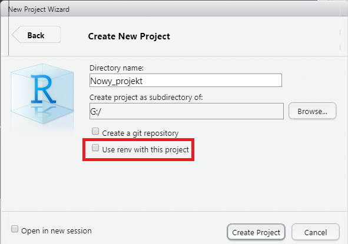

<link href="https://fonts.googleapis.com/css?family=Montserrat&display=swap" rel="stylesheet">

<style>
slides > slide {
  font-family: 'Montserrat', sans-serif;
}

.center {
  display: block;
  margin-left: auto;
  margin-right: auto;

}


</style>

```{r setup, include=FALSE}
knitr::opts_chunk$set(echo = TRUE)
```

# Skrypty w R

## Kształt typowego skryptu

<div style="float: left; width: 40%; font-size:20px;">

1. Wczytanie bibliotek.\

2. Wczytanie dodatkowych skryptów.\

3. Kod.

</div>

<div style="float: right; width: 60%;">


</div>


## Problemy z dzieleniem się skryptami

1. Zmienne środowiskowe:

  
    - **working directory** - bezwzględna ścieżka na komputerze prowadząca do domyślnej lokalizacji plików wczytywanych do R lub zapisywanych z R
  
  
```{r, eval = FALSE}
# sciezka bezwzgledna na danym urzadzeniu - zadziała tylko u Michala
read.csv("C:/Michal/projekt/dane.csv")

# getwd() zwraca working directory
getwd()

# setwd() zmienia working directory
setwd("C:/Krysia/projekt")
read.csv("dane.csv") # zadziała u Krysi

```


##

Zmiana working directory z poziomu Rstudio


  
##
  - **options** - funkcja *options()* pozwala użytkownikowi na zmianę różnych opcji opisujących sposób,
  w jaki R liczy oraz wyświetla wyniki. Wywołanie **options()** - zwraca wszystkie obecnie ustawione opcje.
  

Przykłady: 


 <font size="4.5"> 
 
 - **digits** - ustawia ilość wyświetlanych cyfr znaczących (domyślnie 7) 
 
 </font>


```{r}
options(digits = 10)
print(pi)

```


 <font size="4.5"> 
 
 - **warn** - liczbą całkowitą określamy sposób obchodzenia się z warningami (warn < 0 - wszystkie warningi są ignorowane, warn = 0 - warningi są wyświetlane kiedy funkcja zwróci ostateczny wynik, warn = 1 - warningi są wyświetlane na bieżąco, warn > 1 - warningi są traktowane jak errory)
 
 </font>

  
```{r, eval = FALSE}

options(warn = 1)
```


  
##
  
  - **inne cechy**, np. liczba rdzeni
  
```{r}
library(parallel)

detectCores()
```
  
##

2. Konflikty nazw.

 <font size="4.5"> 
 
Zdarza się, że nazwy obiektów pokrywają się pomiędzy różnymi pakietami. 

Przykład: funkcja *filter()* z pakietów *dplyr* i *stats*.
 
 </font>


```{r}
library(stats)
library(dplyr)
```

##
 <font size="4.5"> 
 
Wywołując teraz funkcję *filter()* użyjemy funkcji z pakietu dplyr - do filtrowania ramek danych
 
 </font>


```{r}
filter(iris, Sepal.Length == 5.1, Sepal.Width == 3.5)
```

 <font size="4.5"> 

Możemy sprecyzować pakiet, z którego chcemy importować konkretną funkcję. W przypadku pakietu *stats* i funkcji *filter()* zrobimy to następująco:
 
 </font>

```{r}

x <- 1:15
stats::filter(x, rep(1, 3))

```


##

3. Wersje bibliotek.

<font size="4.5"> 

Biblioteki w R są ciągle ulepszane, więc warto precyzować wersję biblioteki, w której kod działa poprawnie. Na przykład:
 
 </font>

```{r, eval = FALSE}
example_list <- list(iris, iris)
dplyr::rbind_list(iris, iris) #nie działa
```

```{r, echo=FALSE}
print("Error: 'rbind_list' is not an exported object from 'namespace:dplyr'")
```

<font size="4.5"> 
W najnowszych wersjach pakietu *dplyr* funkcję *rbind_list()* zastąpiła funkcja *bind_rows()*. 

 </font>

```{r, eval = FALSE}
dplyr::bind_rows(example_list) #działa
```

```{r, echo = FALSE}
example_list <- list(iris, iris)
head(dplyr::bind_rows(example_list), n=3)
```

##
<font size="4.5"> 

Historię zmian w pakiecie *dplyr* można sprawdzić tutaj 

https://dplyr.tidyverse.org/news/index.html


Jak sprawić, żeby stary kod używający funkcji *rbind_list()* nadal działał?

- Ładujemy starszą wersję pakietu - dplyr 0.8.5

```{r, eval = FALSE}
detach("package:dplyr", unload = TRUE)

url <- "https://cran.r-project.org/src/contrib/Archive/dplyr/dplyr_0.8.5.tar.gz"
install.packages(url, repos=NULL, type="source")

```

- Starsze wersje pakietów można znaleźć w archiwum Cranu: 

https://cran.r-project.org/src/contrib/Archive/dplyr/

 </font>


# Projekty w RStudio

## Tworzenie projektu 


## New directory

<div style="float: left; width: 50%; font-size:20px;">

</div>
<div style="float: right; width: 50%; font-size:20px;">

</div>


## Existing directory


# renv

##

### Co to jest renv

Pakiet służący do zarządzania dependencjami projektów eR-owych.

### Używanie renv


- **renv::init()** - inicjowanie nowego lokalnego środowiska z prywatną biblioteką eRową.

- normalna praca z projktem - instalowanie i usuwanie pakietów w razie potrzeby

- **renv::snapshot()** - zapisywanie aktualnego stanu biblioteki w projekcie do pliku *renv.lock*

- **renv::restore()** - powrót do stanu zapisanego w *renv.lock*

##

Renv może być także uruchomiony dla projektu podczas jego tworzenia




# Dokumenty w Rmd
