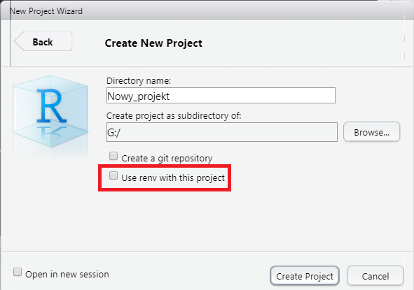

<link href="https://fonts.googleapis.com/css?family=Montserrat&display=swap" rel="stylesheet">

<style>
slides > slide {
  font-family: 'Montserrat', sans-serif;
}

.center {
  display: block;
  margin-left: auto;
  margin-right: auto;

}


</style>

```{r setup, include=FALSE}
knitr::opts_chunk$set(echo = TRUE)
```


# renv

## Co to jest renv

Pakiet służący do zarządzania pakietami w projektach eR-owych.

## Używanie renv


- **renv::init()** - inicjowanie nowego lokalnego środowiska z prywatną biblioteką eRową.

- normalna praca z projektem - instalowanie i usuwanie pakietów w razie potrzeby

- **renv::snapshot()** - zapisywanie aktualnego stanu biblioteki w projekcie do pliku *renv.lock*

- **renv::restore()** - powrót do stanu zapisanego w *renv.lock*

##

Renv może być także uruchomiony dla projektu podczas jego tworzenia




# Dokumenty w Rmd
