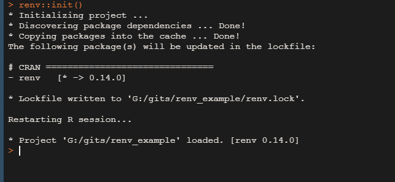
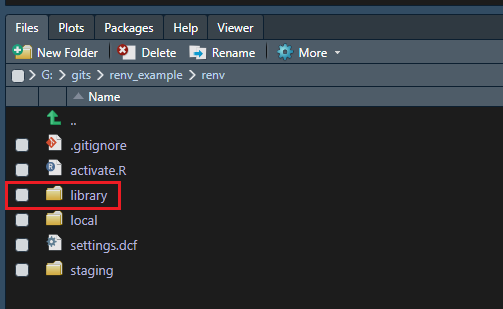
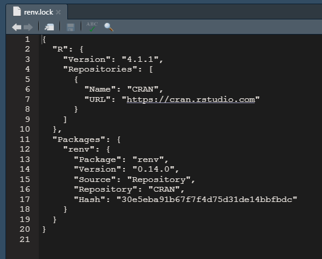
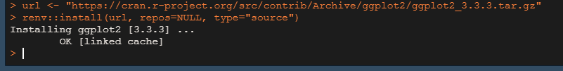
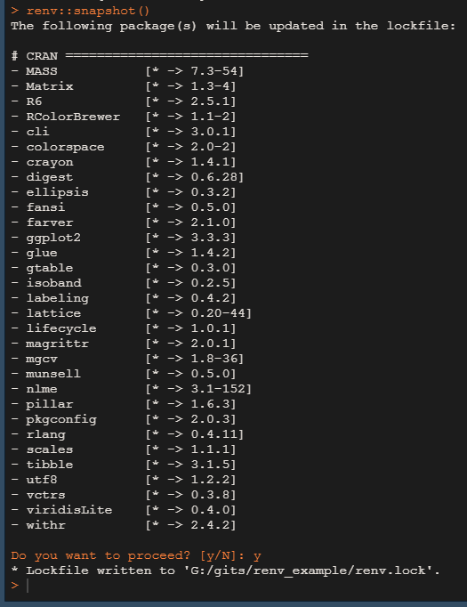
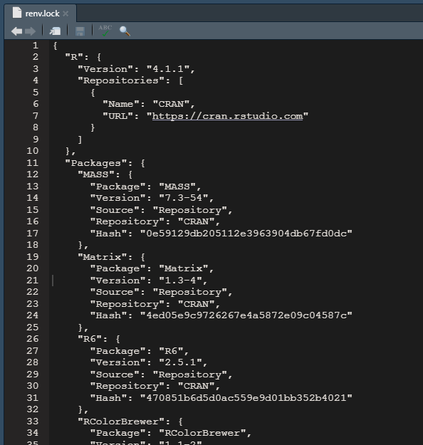
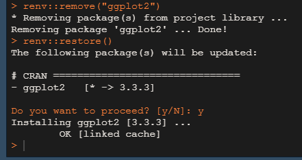

<link href="https://fonts.googleapis.com/css?family=Montserrat&display=swap" rel="stylesheet">

<style>
slides > slide {
  font-family: 'Montserrat', sans-serif;
}

.center {
  display: block;
  margin-left: auto;
  margin-right: auto;

}


</style>

```{r setup, include=FALSE}
knitr::opts_chunk$set(echo = TRUE)
```


# renv

## Co to jest renv

Pakiet służący do zarządzania pakietami w projektach eR-owych.

- przykładowe repozytorium: https://github.com/KrystynaGrzesiak/renv_example

## Używanie renv 

- **renv::init()** - inicjowanie nowego lokalnego środowiska z prywatną biblioteką eRową.


<div style="float: left; width: 50%; font-size:20px;">



</div>
<div style="float: right; width: 45%; font-size:20px;">

</div>


##

- **renv::install()** normalna praca z projektem - instalowanie i usuwanie pakietów w razie potrzeby

Przykładowo instalujemy konkretną (archiwalną) wersję pakietu *ggplot2*:

```{r, eval = FALSE}
url <- "https://cran.r-project.org/src/contrib/Archive/ggplot2/ggplot2_3.3.3.tar.gz"
renv::install(url, repos=NULL, type="source")
```




##

- **renv::snapshot()** - zapisywanie aktualnego stanu biblioteki w projekcie do pliku *renv.lock*

<div style="float: left; width: 50%; font-size:20px;">

</div>
<div style="float: right; width: 50%; font-size:20px;">

</div>

##

- **renv::restore()** - powrót do stanu zapisanego w *renv.lock*




##

Renv może być także uruchomiony dla projektu podczas jego tworzenia


# Dokumenty w Rmd

## Zobacz:

- Dokument_w_Rmd.Rmd

- piekny_html.Rmd

- prezentacja3.Rmd
